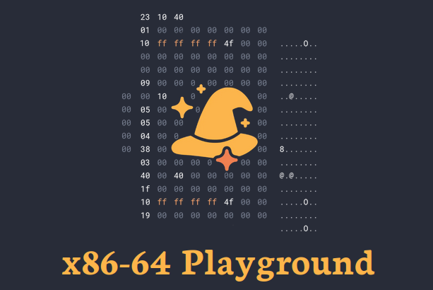

 

An online assembly editor and GDB-like debugger for the x86-64 architecture,  powered by a Wasm port of the Blink x86-64-linux emulator.

Online at https://x64.halb.it

## features

- Test and debug your assembly snippets from the browser, on an emulated x86-64-Linux environment. The web app offers a wide range of popular amd64 assemblers: GNU Binutils, Fasm, Nasm. You can fully customize the command line arguments or even provide your own assemblers.
- Run and debug your assembly snippets, or any x86-64-Linux ELF you upload. The app features an accessible interface inspired by the GDB debugger where you can step into your program, and visualize disassembly, memory and registers of the emulated process.
- Share your assembly snippets with others, or embed the app in any web page to add interactive elements to your technical articles.

## Project overview

The web app is organized as a static web app, without any server side component. It's compiled and hosted on GitHub pages.
Both the emulator and debugger run client side, in a webAssembly port of the [blink](https://github.com/jart/blink/) emulator.
The emulator has been patched and modified to run as a C library, that exposes it's APIs to the web app via a Typescript wrapper.

## Licenses

The logo for this website is based on work distributed under the Creative Commons Attribution License [CC BY 3.0](https://creativecommons.org/publicdomain/mark/1.0/)
by [Nur Achmadi Yusuf](https://thenounproject.com/icon/wizard-hat-6586306/)

