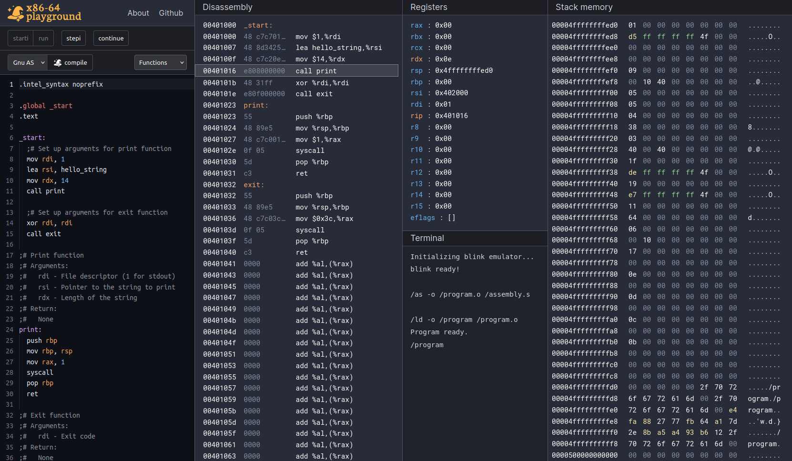
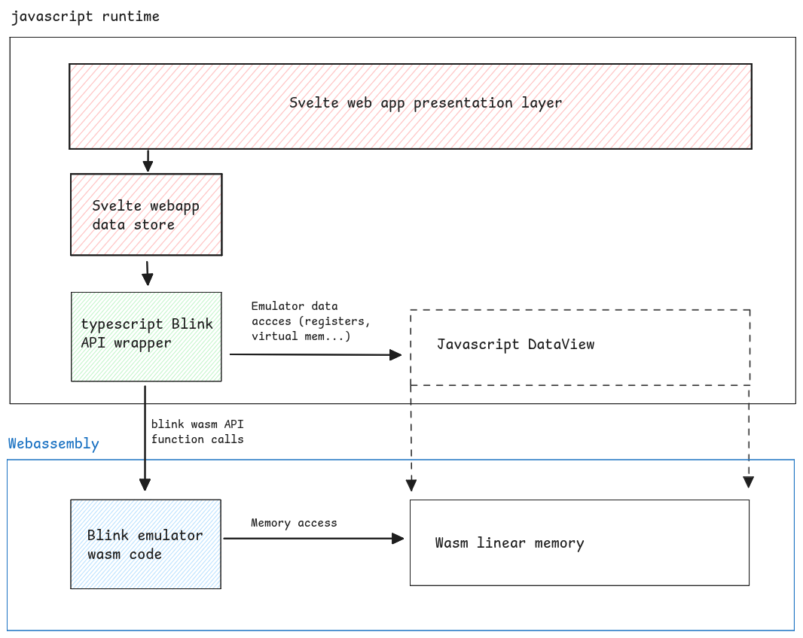

# x86-64 playground

An online assembly editor and debugger for the x86-64 architecture, powered by a Wasm port of the Blink x86-64-linux emulator.  Online at https://x64.halb.it

The quickest way to run, debug, and share assembly snippets for a wide range of popular assemblers, like GNU binutils, Fasm, and Nasm.

## features

- Support for most assemblers: GNU Binutils, Fasm, and Nasm. These programs are real x86-64 ELFs, emulated client-side. You are free
  to configure their command-line arguments and file input.
- Editor with syntax-highlighting and error diagnostics
- Simple, distraction-free interface implementing a reduced set of the gdb commands and behaviour.
  every button in the debugger is labelled with the name of the corresponding gdb command.
- Debugger focused on data visualizations typical of the binary exploitation ctf world:
  Registers and stack hexdump are displayed in the same way as gdb with the gef or pwngdb plugin enabled.
- Mobile friendly, accessible interface running entirely client-side. Easily loads with slow internet connections thanks to its lightweight bundle size.

## Project overview

This project is divided in two areas of development:
- the typescript svelte webapp
- the c x86-64-Linux [blink](https://github.com/jart/blink/) emulator, modified to be used as a webassembly library.

Using Emscripten, the modified blink emulator is compiled into a wasm file and and a companion javascript module.
The typescrpt webapp then implements an API interface around these two artifacts. A bird-eye overview of the whole architecture is described in the diagram below:

## Licenses

The logo for this website is based on work distributed under the Creative Commons Attribution License [CC BY 3.0](https://creativecommons.org/publicdomain/mark/1.0/)
by [Nur Achmadi Yusuf](https://thenounproject.com/icon/wizard-hat-6586306/)

