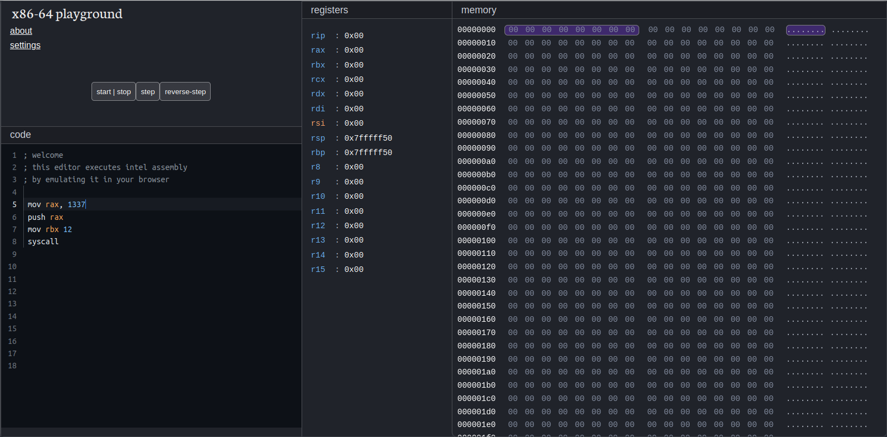

# x86-64 playground

a wasm-based x86-64 assembly playground, running entiretly in the browser

The project is composed of two elements:
- `emscripten_blink` a fork of the [blink](https://github.com/jart/blink/) x86-64 emulator, modified to run on the web with the emscripten toolchain.
- `svelte_blinkenweb` a svelte webapp that depends on the wasm build artifacts of `emscripten_blink` to run.
